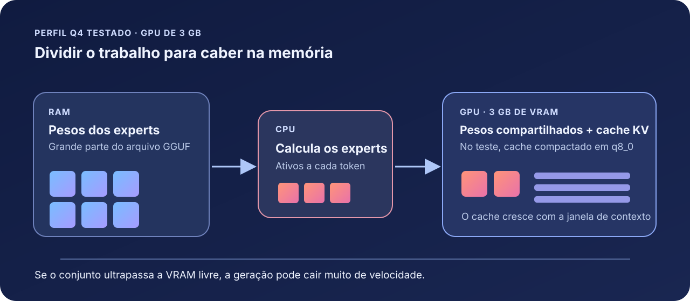
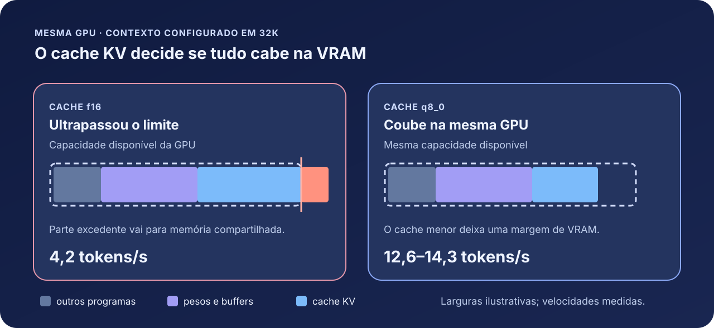

# Como fiz uma IA local rodar bem numa placa de vídeo de 3 GB

*O resultado não veio de um ajuste milagroso. Veio de descobrir exatamente onde a memória acabava — e de medir o que acontecia depois.*

*Esquema do perfil testado: os pesos ficam em parte na RAM e em parte na GPU; o cache KV pode ficar na VRAM ou na RAM, conforme a configuração.*

Eu queria usar um modelo de linguagem no meu próprio computador, sem depender de um serviço remoto. O obstáculo parecia óbvio: minha GTX 1060 tem **3 GB de VRAM**, enquanto o arquivo do modelo que eu queria testar tem **20,8 GiB**. Ainda assim, cheguei a cerca de **13 a 14 tokens por segundo** em certas configurações. Em outras, no mesmo PC, a velocidade caía para **aproximadamente 4 tokens por segundo**.

O que explica essa diferença é mais interessante do que a velocidade máxima. É o assunto deste texto: como dividir o trabalho entre CPU, RAM e GPU; por que o contexto da conversa pode consumir a memória que faltava; e como transformar medições em uma escolha de configuração que acompanhe o estado do PC.

Os testes foram feitos em setembro de 2026, num **Ryzen 5 1600, GTX 1060 de 3 GB, 32 GB de RAM DDR4 em dois canais e Windows 11**, com o `llama.cpp` b11149. O modelo era um GGUF Q4 do **Qwen3.6-35B-A3B**, com arquitetura *mixture of experts* (MoE). GGUF é o formato do arquivo usado pelo programa; Q4 indica uma versão compactada dos pesos. É um PC com GPU antiga e pouca VRAM, mas **32 GB de RAM não são pouca coisa**. Rodar esse arquivo específico em uma máquina com 8 GB de RAM não é uma expectativa realista. Os números abaixo descrevem esse conjunto de hardware, modelo e programa; o método é o que pode ser levado para outro computador. [Veja a calibração completa.](CALIBRACAO.md)

## A primeira surpresa: o modelo não precisa caber inteiro na GPU

“35 bilhões de parâmetros” sugere uma placa de vídeo enorme. Num MoE, porém, nem todos os parâmetros trabalham em cada token: neste modelo, são cerca de **3 bilhões ativos por token**. Configurei o `llama.cpp` para deixar os *experts* principalmente na RAM e usar a GPU para as partes compartilhadas do cálculo. Isso permite aproveitar uma GPU pequena, embora transfira muito trabalho para a CPU e para a memória principal.

*Os blocos representam experts. A quantidade desenhada é ilustrativa; a seleção depende da arquitetura do modelo e muda a cada token.*

Há ainda outro consumidor de memória: o **cache KV**, que guarda informação usada para consultar o histórico da conversa. Ele cresce com a janela de contexto configurada. Uma conversa de 32 mil tokens exige mais espaço do que uma de 8 mil, mesmo antes de você preencher toda a janela. Os buffers de cálculo também ocupam VRAM. Portanto, a pergunta útil não é “o arquivo do modelo cabe na GPU?”, mas **“pesos, cache, buffers e os outros programas cabem ao mesmo tempo?”**

## O degrau de desempenho que mudou a investigação

Comecei usando o `llama-bench`, a ferramenta de medição do próprio `llama.cpp`. Ela apontava algo próximo de **14 tokens/s**. Quando subi o servidor com **32 mil tokens de contexto**, obtive **4,2 tokens/s**. Parecia uma contradição, até perceber que o teste rápido não reproduzia a memória exigida pelo servidor na configuração real.

No meu teste, quando a combinação de pesos, cache e buffers ultrapassava a VRAM disponível, parte do uso passava pela memória compartilhada do Windows. A geração não ficava apenas um pouco mais lenta: caía de cerca de 14 para cerca de 4 tokens/s. Chamei isso de **degrau de VRAM**. A VRAM já ocupada pelo desktop também variou: navegador, terminal e gerenciador de janelas mudavam o espaço restante antes mesmo de carregar o modelo.

*Os tamanhos das barras são ilustrativos; as velocidades vêm dos testes. A VRAM disponível depende do que os outros programas já ocupam.*

Foi aí que um ajuste pequeno no comando produziu o maior ganho observado:

| Teste com o GGUF Q4 | Geração medida |
| --- | ---: |
| Contexto de 32K, cache KV `f16` | **4,2 tokens/s** |
| Contexto de 32K, cache KV `q8_0` | **12,6 a 14,3 tokens/s** |
| Contexto de 32K, cache KV na RAM | **9,1 a 9,2 tokens/s** |

O comando que fez a diferença foi `-ctk q8_0 -ctv q8_0`: ele usa uma representação de 8 bits para as duas partes do cache KV, reduzindo aproximadamente pela metade seu espaço em comparação com `f16`. [Essas opções estão documentadas pelo `llama.cpp`.](https://github.com/ggml-org/llama.cpp/blob/master/tools/server/README.md) Nesta medição, a mudança permitiu que a configuração voltasse a caber na VRAM. **Isso é ganho de velocidade, não uma comprovação de que a qualidade das respostas ficou idêntica**: não fizemos um teste forte o suficiente para medir essa diferença.

Mesmo quando tudo cabe, mais contexto tem custo. Em outro teste, com cache `q8_0`, a geração foi de **14,6 tokens/s** com o contexto vazio, **12,5** com 16K tokens já ocupados e **11,0** com 30K. Também é preciso distinguir duas velocidades: **leitura do prompt**, que afeta quanto você espera depois de colar um texto grande, e **geração**, que é o ritmo em que a resposta aparece. Um token é uma unidade do modelo; **tokens/s não são palavras/s**. [O `llama-bench` separa essas medições e permite testar diferentes profundidades de contexto.](https://github.com/ggml-org/llama.cpp/blob/master/tools/llama-bench/README.md)

## Três escolhas para um PC que muda ao longo do dia

Depois de reduzir o cache, testei alternativas para quando outros programas usam a GPU:

1. **Diminuir o contexto.** Passar de 32K para 16K ou 8K libera VRAM. É a escolha para quem prioriza resposta rápida e não precisa enviar um histórico longo inteiro a cada pergunta.
2. **Mover a camada de saída para a CPU.** O argumento `-ot output.weight=CPU` liberou cerca de **400 MiB de VRAM** nesta máquina. Com mais VRAM ocupada pelo desktop, o perfil de 32K que caía para **4,1 tokens/s** passou a marcar **9,6 tokens/s** com essa mudança. O preço é usar mais a CPU e perder alguns tokens/s quando a GPU já tinha espaço de sobra.
3. **Deixar a recomendação acompanhar o PC.** Uma configuração que funcionou às 10h pode não caber às 15h se um navegador ou outro teste ocupar a placa. A escolha precisa considerar a VRAM **antes** de iniciar o modelo, com margem para oscilações.

Isso levou aos perfis do **Summanus**, o app em Rust que construímos para conversar com o modelo: **A** usa Q4 com 16K para privilegiar velocidade; **B** usa Q4 com 32K e a camada de saída na CPU para abrir espaço na GPU; **C** usa Q4 com 32K e a saída na GPU quando há folga. Há também perfis com um arquivo IQ3 menor e um perfil “Paciente”, só na CPU. Esses perfis são opções, não promessas de velocidade: o IQ3 não recebeu a mesma calibração de VRAM do Q4. [Os detalhes atuais dos perfis estão no README.](../README.md#perfis-de-execução)

## A RAM e a CPU também têm limites

Uma GPU de 3 GB só pôde participar porque uma grande parte do modelo ficou na memória principal. Para descobrir a folga necessária, reservamos RAM *antes* de carregar o Q4 de 20,8 GiB, com contexto de 8K:

| RAM disponível antes da carga | Geração | Tempo de carga |
| --- | ---: | ---: |
| 26,4 GiB | 12,7 tokens/s | 7 s |
| 21,0 GiB | 12,6 tokens/s | 13 s |
| 19,0 GiB | 10,9 tokens/s | 15 s |
| 17,0 GiB | 5,7 tokens/s | 29 s |

O limite aqui não é uma regra universal como “precisa ter exatamente 21 GB livres”. É uma observação: **neste arranjo**, abaixo de certa folga a perda ficou grande, e a carga também demorou mais. A CPU sofre interferência semelhante. Com outros processos ocupando cerca de 67% das 12 threads lógicas, quatro threads dedicadas ao modelo renderam **9,2 tokens/s**, contra **7,4** com oito threads. Foram poucos pontos de teste, então uso esse resultado como direção, não como fórmula geral.

## Como medi sem me enganar com um número bonito

A parte mais útil do projeto talvez seja o procedimento. Primeiro, registrei quanta VRAM o PC já usava; depois comparei uma variável por vez, repetindo os testes. Usei o `llama-bench` para explorar opções e o `llama-server` para validar a configuração com o **contexto real**. Medi a geração pelo campo `timings.predicted_per_second` retornado pelo servidor, que também aparece no Summanus. [O próprio projeto `llama.cpp` usa essa métrica em seus testes de servidor.](https://github.com/ggml-org/llama.cpp/blob/master/tools/server/bench/speed-bench/README.md)

*Com o Q4 em 8K, o último teste rápido foi em 858 MiB e o primeiro lento em 1.095 MiB de VRAM já ocupada. O limite exato entre eles não foi medido.*

Para descobrir onde começava o degrau, um pequeno script reservou quantidades controladas de VRAM, simulando outros aplicativos abertos. Repeti cada configuração em vários níveis de ocupação e anotei o **maior nível em que ainda foi rápida** e o **primeiro nível em que ficou lenta**. Entre esses dois pontos, o resultado é incerto; por isso a recomendação usa uma margem, em vez de apostar no limite. Repeti a ideia para CPU e RAM. Os scripts e as tabelas estão no [guia de calibração](CALIBRACAO.md).

O resultado prático é um recomendador que consulta o uso atual de RAM, CPU e VRAM **antes de carregar o modelo**. O Summanus o chama ao abrir, mostra a sugestão e permite escolher outro perfil mesmo quando ele alerta para possível lentidão. A interface também exibe a velocidade real da resposta. Esse cuidado evita confundir a estimativa do recomendador com uma medição feita durante a conversa.

## O que eu faria se estivesse começando hoje

1. Escolheria um modelo GGUF cujo arquivo caiba com folga na **RAM disponível**, considerando também sistema e aplicativos. Se a máquina tiver 8 ou 16 GB, começaria por um arquivo bem menor do que o Q4 deste artigo.
2. Mediria a VRAM já usada e faria testes curtos de geração e leitura do prompt. Testaria o **servidor com o contexto desejado**, não apenas um benchmark de contexto pequeno.
3. Se a velocidade caísse abruptamente ao aumentar o contexto, testaria `-ctk q8_0 -ctv q8_0`, depois um contexto menor ou a camada de saída na CPU. Compararia tanto **tokens/s** quanto a qualidade das respostas para meu uso.
4. Guardaria pelo menos dois perfis: um rápido, com contexto menor, e outro para conversas longas. Reavaliaria quando o uso da RAM ou da GPU mudasse.
5. Evitaria enviar arquivos enormes sem pensar: selecionar apenas a função relevante de um `.py`, anexar um trecho ou resumir etapas antigas da conversa costuma ser mais útil do que ocupar a janela inteira. No Summanus, a importação avisa antes de anexar trechos grandes, e a compactação preserva o histórico original no app.

O aprendizado foi simples de enunciar e trabalhoso de medir: **uma IA local em hardware limitado depende tanto da distribuição da memória quanto da capacidade bruta do modelo**. A GTX 1060 de 3 GB não passou a ter mais memória. Nós encontramos uma forma de usar a RAM e a CPU com intenção, economizamos o cache do contexto e deixamos a configuração responder ao que o PC consegue oferecer naquele momento.

*Medições e scripts: [Guia de calibração do projeto](CALIBRACAO.md) · [Código do Summanus](../README.md) · [Opções do `llama-server`](https://github.com/ggml-org/llama.cpp/blob/master/tools/server/README.md).*
